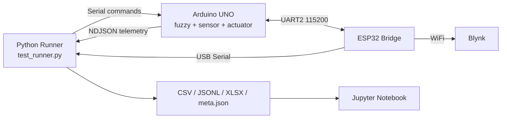
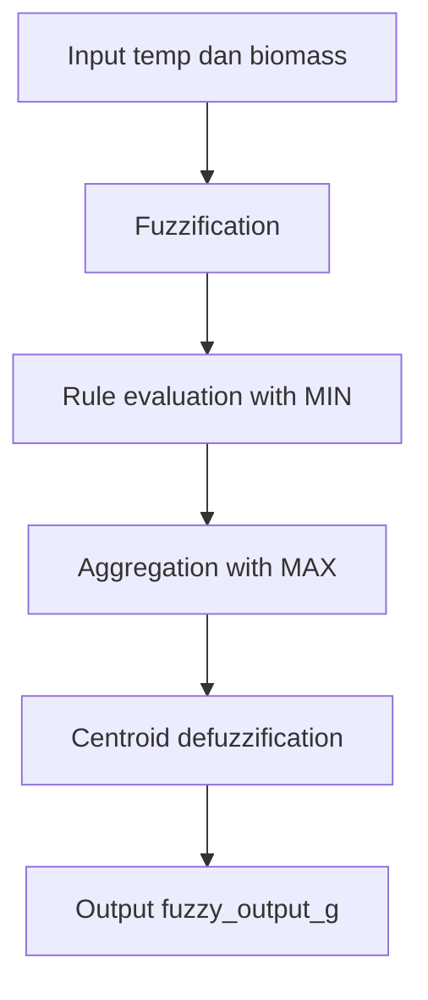
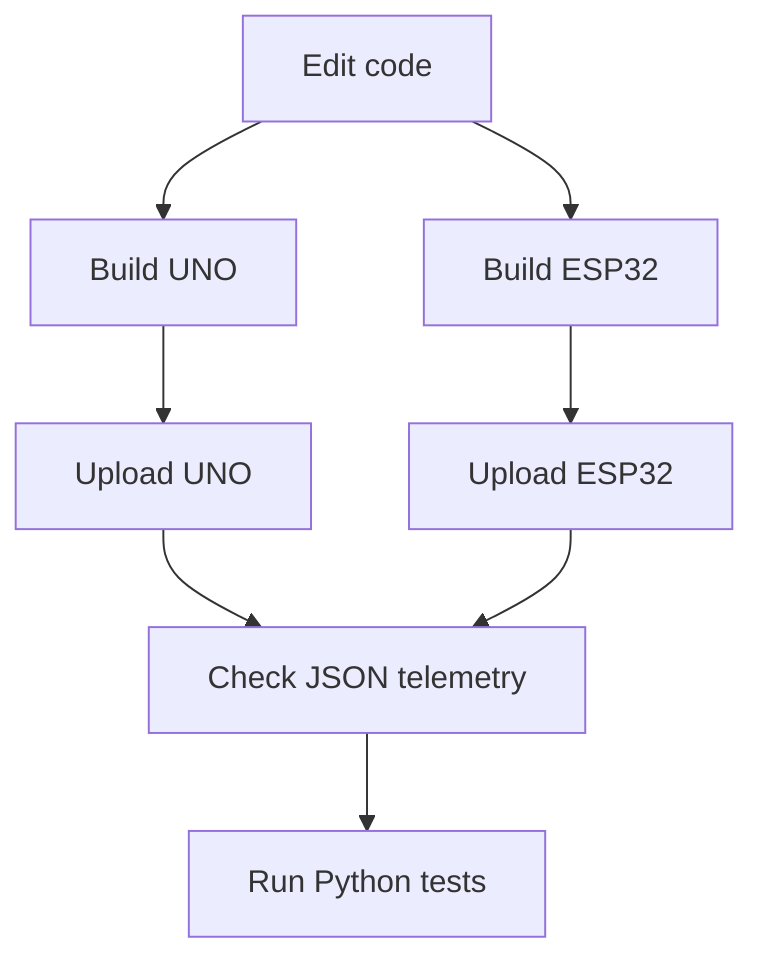
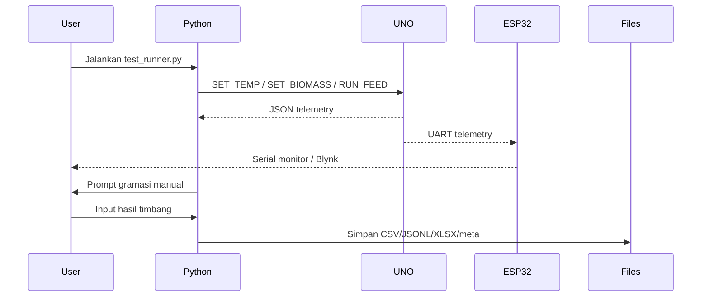
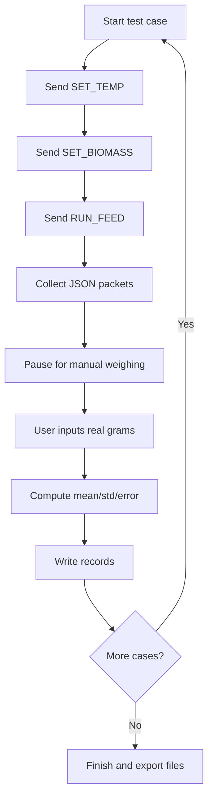

# Feeder Research System

Dokumen ini menjelaskan versi proyek yang aktif saat ini: firmware baru berbasis PlatformIO di `feeder-platformio/` dan project Python riset di `feeder-research/`.

Folder `example/` tidak dipakai sebagai basis logika. Folder itu hanya referensi wiring dari proyek lama.

## 1. Ringkasan Sistem

Sistem terdiri dari tiga lapisan:

- `Arduino UNO` menjalankan fuzzy Mamdani, membaca sensor, menghitung keluaran pakan, dan menggerakkan aktuator.
- `ESP32` bertindak sebagai bridge UART dan node Blynk.
- `Python` menjalankan otomatisasi eksperimen, logging data, dan analisis hasil.



## 2. Arsitektur Folder

```text
D:\Aerasea\TA_KURNI\
├── feeder-platformio\
│   ├── include\
│   │   ├── fuzzy_model.h
│   │   ├── secrets.h
│   │   └── secrets.example.h
│   ├── src\
│   │   ├── uno\
│   │   │   └── main.cpp
│   │   └── esp32\
│   │       └── main.cpp
│   └── platformio.ini
├── feeder-research\
│   ├── .venv\
│   ├── data\
│   │   └── raw\
│   ├── notebooks\
│   │   ├── analysis.ipynb
│   │   └── fuzzy_feeder_paper_ready.ipynb
│   ├── paper_assets\
│   ├── python\
│   │   ├── controller\
│   │   │   └── serial_controller.py
│   │   ├── logger\
│   │   │   └── data_logger.py
│   │   ├── runner\
│   │   │   └── test_runner.py
│   │   └── utils\
│   │       └── parser.py
│   ├── README.md
│   └── requirements.txt
├── paper\
└── example\
```

## 3. Logika Fuzzy yang Dipakai

Firmware dan notebook paper-ready sekarang memakai model fuzzy Mamdani yang sama.

### 3.1 Variabel Input

- Suhu air:
  - `cold`: trimf `(20, 25, 30)`
  - `normal`: trimf `(26, 30, 34)`
  - `warm`: trimf `(28, 34, 38)`
- Biomassa:
  - `small`: trimf `(0, 1000, 2000)`
  - `medium`: trimf `(1500, 2500, 3500)`
  - `large`: trimf `(2000, 4000, 5500)`

### 3.2 Variabel Output

- Feed output:
  - `low`: trimf `(0, 30, 60)`
  - `medium`: trimf `(40, 70, 100)`
  - `high`: trimf `(80, 110, 150)`

### 3.3 Rule Base

| Temperature | Biomass | Output |
|---|---|---|
| cold | small | low |
| cold | medium | low |
| cold | large | medium |
| normal | small | low |
| normal | medium | medium |
| normal | large | high |
| warm | small | medium |
| warm | medium | high |
| warm | large | high |

### 3.4 Alur Inferensi



## 4. Format Telemetri

UNO mengirim newline-delimited JSON pada `115200 baud`.

Contoh:

```json
{
  "timestamp": 12345,
  "temp": 29.4,
  "distance_mm": 176.2,
  "feed_estimate_g": 742.5,
  "biomass": 2000.0,
  "fuzzy_output_g": 68.1,
  "pwm": 60,
  "duration_s": 14.2,
  "mode": "SIM_FUZZY",
  "event": "REMOTE_FEED",
  "state": 2,
  "mu_temp_cold": 0.000,
  "mu_temp_normal": 0.850,
  "mu_temp_warm": 0.233,
  "mu_bio_small": 0.000,
  "mu_bio_medium": 0.500,
  "mu_bio_large": 0.000,
  "mu_out_low": 0.000,
  "mu_out_medium": 0.500,
  "mu_out_high": 0.233
}
```

Field membership ini penting untuk analisis paper dan validasi proses fuzzy di firmware.

## 5. Command Serial yang Didukung

Command utama:

- `SIM_MODE:ON`
- `SIM_MODE:OFF`
- `SET_TEMP:28`
- `SET_BIOMASS:2000`
- `SET_DISTANCE:25`
- `SET_PWM:60`
- `SET_GPS100:8`
- `SET_REAL_WEIGHT:28.6`
- `REQUEST_STATUS`
- `RUN_FEED`

Command ini dapat dikirim dari:

- Python runner
- serial monitor
- VS Code serial terminal
- ESP32 bridge

## 6. Persiapan Python Environment

Venv proyek berada di:

```powershell
D:\Aerasea\TA_KURNI\feeder-research\.venv
```

Aktivasi:

```powershell
cd D:\Aerasea\TA_KURNI\feeder-research
.\.venv\Scripts\Activate.ps1
```

Jika PowerShell memblokir script:

```powershell
Set-ExecutionPolicy -Scope Process -ExecutionPolicy Bypass
.\.venv\Scripts\Activate.ps1
```

Verifikasi:

```powershell
python --version
pip list
```

Dependensi utama:

- `pyserial`
- `pandas`
- `numpy`
- `matplotlib`
- `plotly`
- `jupyter`
- `openpyxl`

## 7. Menjalankan Notebook di VS Code dengan Venv Proyek

Langkah yang benar di VS Code:

1. Buka folder `D:\Aerasea\TA_KURNI\feeder-research`.
2. Tekan `Ctrl+Shift+P`.
3. Pilih `Python: Select Interpreter`.
4. Pilih interpreter:

```text
D:\Aerasea\TA_KURNI\feeder-research\.venv\Scripts\python.exe
```

5. Buka notebook `analysis.ipynb` atau `fuzzy_feeder_paper_ready.ipynb`.
6. Pada kanan atas notebook, pilih kernel yang sama, yaitu `.venv`.

Diagram singkatnya:


Jika kernel `.venv` belum muncul, jalankan dulu:

```powershell
cd D:\Aerasea\TA_KURNI\feeder-research
.\.venv\Scripts\Activate.ps1
python -m ipykernel install --user --name feeder-research --display-name "Python (.venv feeder-research)"
```

## 8. Build dan Upload Firmware PlatformIO

Firmware aktif berada di:

- `D:\Aerasea\TA_KURNI\feeder-platformio\src\uno\main.cpp`
- `D:\Aerasea\TA_KURNI\feeder-platformio\src\esp32\main.cpp`

Gunakan `PLATFORMIO_CORE_DIR` lokal supaya build stabil pada proyek ini.

### 8.1 Build UNO

```powershell
$env:PLATFORMIO_CORE_DIR='D:\Aerasea\TA_KURNI\feeder-platformio\.platformio-home'
& 'C:\Users\ASUS TUF\.platformio\penv\Scripts\pio.exe' run -d 'D:\Aerasea\TA_KURNI\feeder-platformio' -e uno
```

### 8.2 Upload UNO

```powershell
$env:PLATFORMIO_CORE_DIR='D:\Aerasea\TA_KURNI\feeder-platformio\.platformio-home'
& 'C:\Users\ASUS TUF\.platformio\penv\Scripts\pio.exe' run -d 'D:\Aerasea\TA_KURNI\feeder-platformio' -e uno -t upload
```

### 8.3 Build ESP32

```powershell
$env:PLATFORMIO_CORE_DIR='D:\Aerasea\TA_KURNI\feeder-platformio\.platformio-home'
& 'C:\Users\ASUS TUF\.platformio\penv\Scripts\pio.exe' run -d 'D:\Aerasea\TA_KURNI\feeder-platformio' -e esp32dev
```

### 8.4 Upload ESP32

```powershell
$env:PLATFORMIO_CORE_DIR='D:\Aerasea\TA_KURNI\feeder-platformio\.platformio-home'
& 'C:\Users\ASUS TUF\.platformio\penv\Scripts\pio.exe' run -d 'D:\Aerasea\TA_KURNI\feeder-platformio' -e esp32dev -t upload
```

### 8.5 Alur Firmware



## 9. Menentukan COM Port

Lihat COM port aktif:

```powershell
Get-CimInstance Win32_SerialPort | Select-Object DeviceID, Description
```

Contoh:

- `COM4` = Arduino UNO
- `COM7` = ESP32

Pemakaian:

- Pakai `COM4` jika Python terhubung langsung ke UNO.
- Pakai `COM7` jika Python lewat ESP32 bridge.

## 10. Workflow Operasional Sistem



## 11. Menjalankan Pengujian Otomatis

Aktivasi venv:

```powershell
cd D:\Aerasea\TA_KURNI\feeder-research
.\.venv\Scripts\Activate.ps1
```

Format umum:

```powershell
python .\python\runner\test_runner.py --port COM4 --test A
```

Argumen yang tersedia:

- `--port`
- `--test`
- `--output-dir`
- `--settle-s`
- `--capture-s`
- `--pause-s`
- `--no-manual-weight`

Arti timing:

- `settle-s`: jeda setelah parameter dikirim ke device
- `capture-s`: lama pengambilan telemetri setelah `RUN_FEED`
- `pause-s`: waktu tunggu agar Anda sempat mengambil pakan dan menimbang hasil real

## 12. Definisi Test A, B, C, D yang Aktif

Definisi ini mengikuti implementasi `test_runner.py` saat ini.

### Test A: Sweep Temperatur

- Suhu: `22` sampai `36 C`
- Biomassa tetap: `2000 g`

```powershell
python .\python\runner\test_runner.py --port COM4 --test A --pause-s 20
```

### Test B: Sweep Biomassa

- Temperatur tetap: `30 C`
- Biomassa: `500, 1000, 1500, 2000, 2500, 3500, 4500, 5000 g`

```powershell
python .\python\runner\test_runner.py --port COM4 --test B --pause-s 20
```

### Test C: Full Grid

- Suhu: `22, 26, 30, 34, 36 C`
- Biomassa: `500, 2000, 3500, 5000 g`

```powershell
python .\python\runner\test_runner.py --port COM4 --test C --pause-s 20
```

### Test D: Repeatability

- 10 kali ulangan
- Titik tetap: `30 C`, `2000 g`

```powershell
python .\python\runner\test_runner.py --port COM4 --test D --pause-s 20
```

## 13. Prosedur Lengkap Pengambilan Data

Bagian ini adalah workflow lapangan yang direkomendasikan.

### 13.1 Sebelum Mulai

1. Upload firmware terbaru ke UNO dan ESP32.
2. Pastikan sensor, motor, servo, dan suplai daya sudah siap.
3. Siapkan timbangan digital.
4. Kosongkan wadah pengambilan pakan lalu tara timbangan.
5. Tentukan COM port yang akan dipakai Python.
6. Aktifkan venv.

### 13.2 Jalankan Satu Sesi Pengujian

1. Jalankan `test_runner.py`.
2. Sistem mengaktifkan `SIM_MODE:ON`.
3. Sistem mengirim setpoint suhu dan biomassa.
4. Sistem meminta status lalu mengeksekusi `RUN_FEED`.
5. Telemetri ditangkap selama `capture-s`.
6. Sistem pause selama `pause-s`.
7. Anda timbang hasil pakan real.
8. Anda masukkan satu atau beberapa nilai gramasi.
9. Sistem menyimpan data dan lanjut ke titik berikutnya.



### 13.3 Format Input Gramasi Manual

Contoh input yang valid:

- Satu nilai:

```text
28.4
```

- Beberapa ulangan:

```text
28.4,28.7,28.5
```

- Jika ingin melewati satu titik:

```text
[kosong lalu Enter]
```

### 13.4 Data Manual yang Disimpan

Kolom hasil timbang manual:

- `real_output_g_values`
- `real_output_g_count`
- `real_output_g_mean`
- `real_output_g_std`
- `real_output_g_min`
- `real_output_g_max`
- `measurement_note`

Kolom error otomatis:

- `abs_error_g`
- `pct_error`
- `signed_error_g`

## 14. File Hasil yang Dihasilkan

Setiap sesi menghasilkan:

- `test_x_YYYYMMDD_HHMMSS.csv`
- `test_x_YYYYMMDD_HHMMSS.jsonl`
- `test_x_YYYYMMDD_HHMMSS.xlsx`
- `test_x_YYYYMMDD_HHMMSS_meta.json`

Lokasi default:

```text
D:\Aerasea\TA_KURNI\feeder-research\data\raw\
```

Penjelasan:

- `csv`: tabel utama untuk analisis cepat
- `jsonl`: raw structured telemetry per baris
- `xlsx`: cocok untuk rekap dan pembukaan di Excel
- `meta.json`: metadata eksperimen, field, dan waktu pembuatan

## 15. Membuka dan Menganalisis Data

### 15.1 Notebook Analisis

Notebook:

- `notebooks/analysis.ipynb`

Fungsi:

- load CSV
- plot `temp vs fuzzy_output_g`
- plot `biomass vs fuzzy_output_g`
- surface 3D `temp vs biomass vs output`
- error analysis jika data timbang manual tersedia

Jalankan:

```powershell
cd D:\Aerasea\TA_KURNI\feeder-research
.\.venv\Scripts\Activate.ps1
jupyter notebook
```

### 15.2 Notebook Paper-Ready

Notebook:

- `notebooks/fuzzy_feeder_paper_ready.ipynb`

Fungsi:

- definisi membership function
- rule table
- grafik fuzzy
- fuzzification dan defuzzification
- asset paper ke folder `paper_assets`

## 16. Contoh Skenario Kerja Lengkap

### Skenario 1: Uji Cepat Repeatability

```powershell
cd D:\Aerasea\TA_KURNI\feeder-research
.\.venv\Scripts\Activate.ps1
python .\python\runner\test_runner.py --port COM4 --test D --pause-s 15
```

Gunakan ini untuk cek apakah aktuator dan logger sudah stabil.

### Skenario 2: Ambil Data Grid untuk Surface Plot

```powershell
cd D:\Aerasea\TA_KURNI\feeder-research
.\.venv\Scripts\Activate.ps1
python .\python\runner\test_runner.py --port COM4 --test C --pause-s 20 --capture-s 6
```

Gunakan ini untuk data utama hubungan suhu-biomassa-output.

### Skenario 3: Tanpa Timbangan Manual

```powershell
python .\python\runner\test_runner.py --port COM4 --test A --no-manual-weight
```

Gunakan ini untuk debug awal komunikasi dan fuzzy output.

## 17. Troubleshooting

### Tidak ada data serial

- Pastikan baud rate `115200`.
- Pastikan COM port benar.
- Pastikan hanya satu aplikasi membuka COM port.
- Cek apakah UNO mengirim JSON saat `REQUEST_STATUS`.

### Runner berhenti tapi tidak ada record

- Tambah `--capture-s`.
- Tambah `--settle-s`.
- Pastikan perangkat tidak reset terus saat port dibuka.

### Data timbang manual tidak masuk

- Pastikan input angka dipisah koma, bukan titik koma.
- Gunakan desimal dengan titik, misalnya `28.4`.
- Jika salah format, runner menyimpan nilai manual sebagai kosong.

### Notebook di VS Code tidak memakai venv

- Pilih ulang interpreter `.venv`.
- Pilih kernel notebook `.venv`.
- Jika perlu, install kernel dengan `ipykernel`.

### Build PlatformIO gagal

- Pastikan memakai `PLATFORMIO_CORE_DIR` lokal.
- Build UNO dan ESP32 secara terpisah.
- Jangan campur environment `uno` dan `esp32dev` dalam satu upload command.

## 18. Ringkasan Praktis

Urutan paling aman untuk eksperimen:

1. Build dan upload firmware UNO.
2. Build dan upload firmware ESP32.
3. Cek JSON telemetry di serial monitor.
4. Aktifkan `.venv`.
5. Jalankan `test_runner.py`.
6. Timbang hasil real setiap case.
7. Masukkan gramasi manual saat prompt muncul.
8. Buka hasil di `data/raw`.
9. Analisis di notebook.

Jika README ini tidak sinkron dengan implementasi, acuan utama selalu:

- `feeder-platformio/include/fuzzy_model.h`
- `feeder-platformio/src/uno/main.cpp`
- `feeder-platformio/src/esp32/main.cpp`
- `feeder-research/python/runner/test_runner.py`
- `feeder-research/python/logger/data_logger.py`
